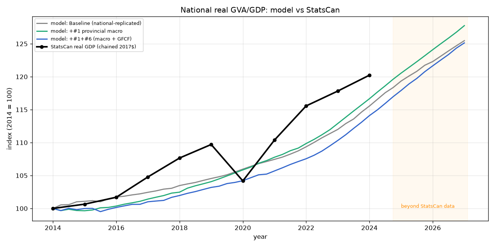
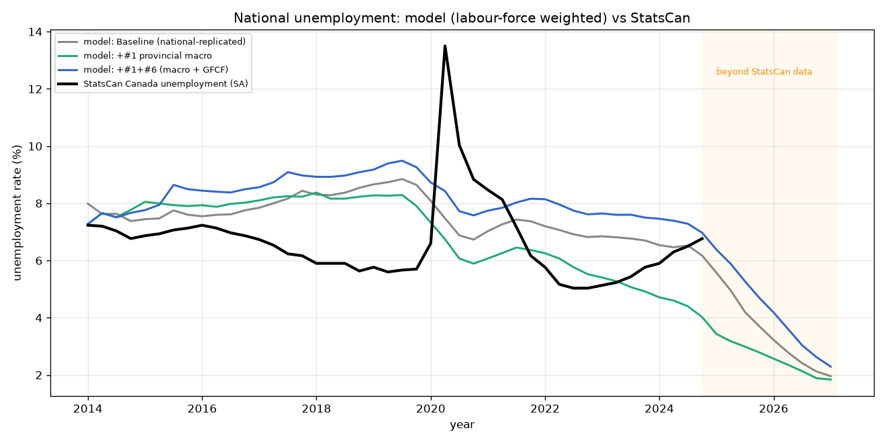
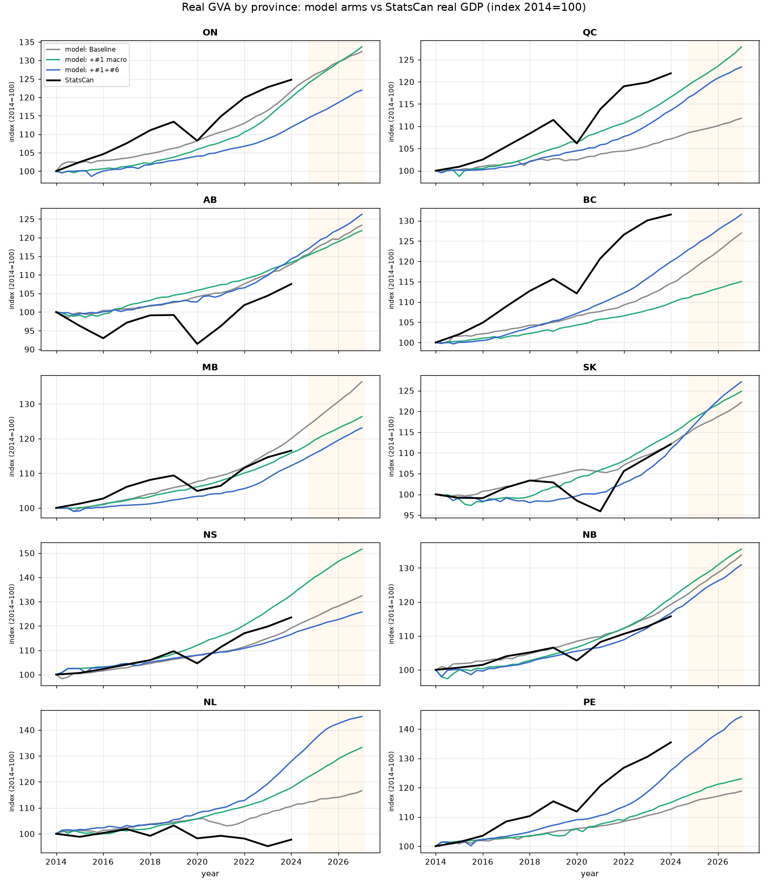
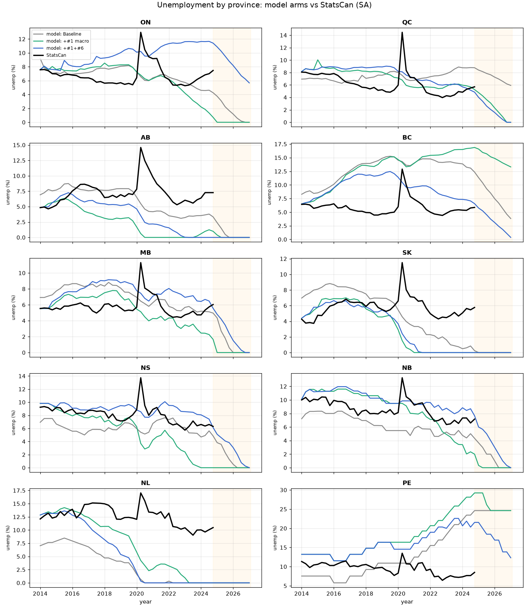
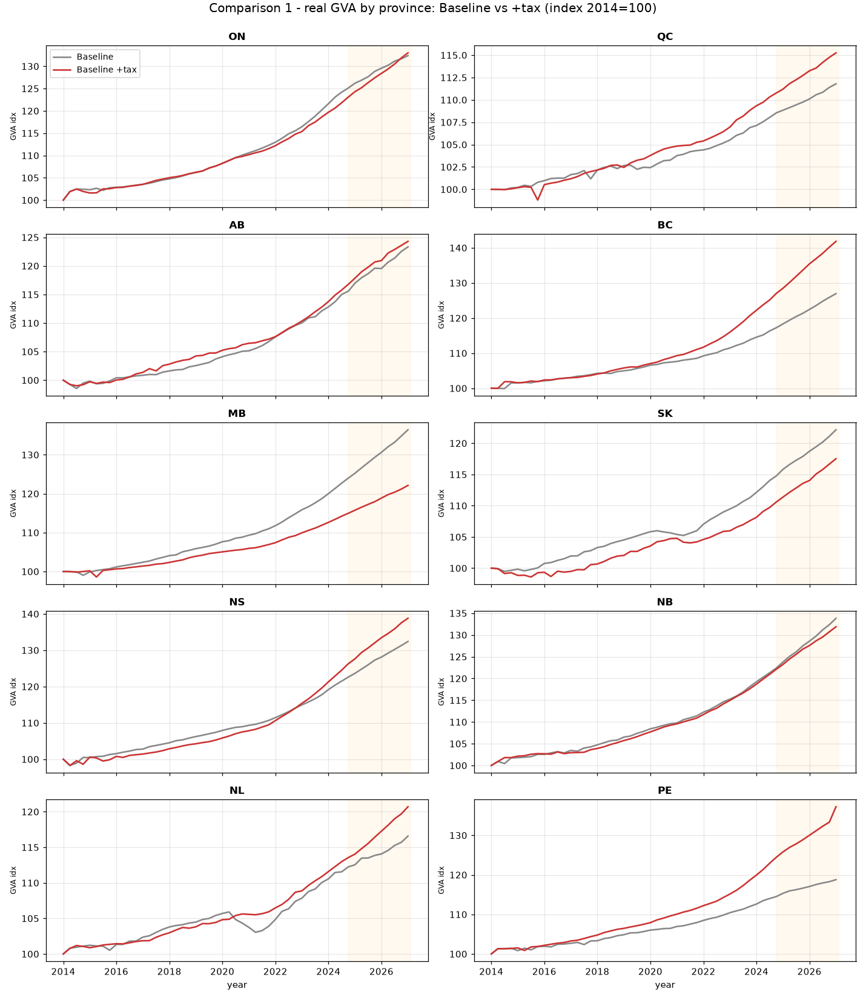
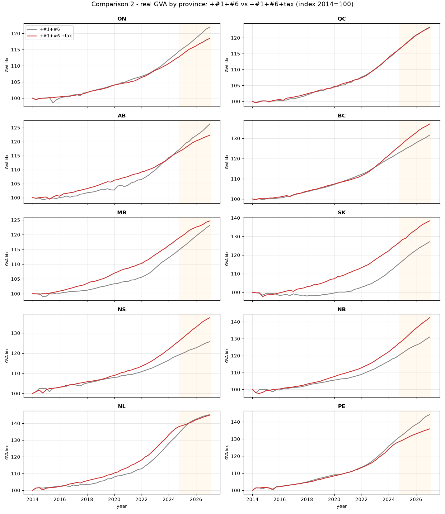
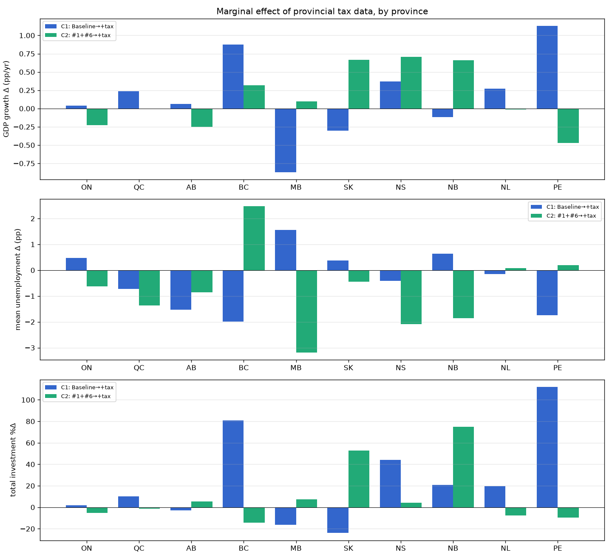

# Provincial Data — Candidate Baseline Incremental Comparison

How each provincial-data commit changes provincial dynamics **under the candidate growth
baseline** (`scripts/run_candidate_baseline.py`), used here as the reference scenario. This
complements `provincial_data_comparison.md` (which used a shorter energy-substitution run);
here the reference is the colleague's `real-growth-baseline` candidate preset.

## Reference scenario

`scripts/run_candidate_baseline.py` / `apply_candidate_growth_baseline`:

- Provincial model (10 provinces × 43 sectors), **candidate growth baseline** preset:
  opt-in firm/labour mechanisms, **observed provincial labour-force paths**
  (`use_observed_labour_path=True`), common **+2%/yr household-demand overlay**, exogenous
  national-accounts held flat past the ~2023Q4 data tail.
- Horizon **53 quarters**, **seed 0**, per-province demography seeds per the runner convention.
- Headline metric: **double-deflated real GVA** (real output − real intermediate, at base-year
  prices), plus unemployment. A capture-runner mirroring the turnkey runner records the same
  quantities **per province**.

## Method — incremental arms

All three arms use the **identical** candidate-baseline simulation config; they differ **only**
in the DataWrapper pickle. Because the provincial overrides are gated on the presence of the
`<raw_data>/canadian_inputs/` files, the arms were produced from the **same code** (branch tip)
by toggling which provincial data is present at build time:

| Arm | Provincial data in the pkl | Corresponds to |
|-----|----------------------------|----------------|
| **Baseline** | none (national/proxy, replicated to provinces) | `real-growth-baseline` behaviour |
| **+#1** | provincial macro series (CPI, unemployment, house prices, vacancy) | commit `b3056cf` |
| **+#1+#6** | + provincial GFCF split (firm/household/government) | commit `20a5e00` (+ `216319f`) |

> The other two commits are **non-functional for results**: the #2–5 commit (`8e68b7e`) is
> documentation only, and the multi-year #6 commit (`216319f`) is byte-identical to #6 at the
> 2014 base year, so neither changes this run. They are therefore not separate arms.

## National result (sum of provinces)

| Arm | Real GVA growth (%/yr) | Real GVA level | Mean unemployment, final |
|-----|----------------------:|----------------|-------------------------:|
| Baseline | 1.76 | 465B → 584B | 3.4% |
| +#1 | 1.90 | 470B → 601B | 3.8% |
| +#1+#6 | 1.74 | 470B → 588B | 1.8% |

The **national aggregate is roughly preserved** (~1.7–1.9%/yr). Both commits act mainly by
**reallocating activity across provinces**, not by moving the national total — which is the
expected and desirable behaviour of a provincial-composition correction.

## Validation against StatsCan (national)

The two headline series are compared to observed StatsCan data over the overlapping years
(2014–2024). The candidate baseline is a **smooth** path (no COVID shock) and runs to ~2027;
the shaded region is beyond the StatsCan data.

### Real GVA / GDP over time

Indexed to 2014 = 100 (model real GVA at base-year prices vs StatsCan real GDP, chained
2017\$). The model reproduces the **trend growth** well — ~1.7–1.9%/yr against Canada's
~1.9%/yr average, and both start and (roughly) end together. As a smooth baseline it does
**not** capture the 2020 COVID contraction and 2021–22 rebound, so by 2024 it sits a little
below the actual (model ≈ 115–117 vs StatsCan 120). The **+#1** arm tracks the observed path
most closely.

### Unemployment over time

Model national unemployment (**labour-force-weighted** using 2014 provincial weights, so it is
comparable to StatsCan's national rate) vs StatsCan Canada seasonally-adjusted rate. The model
**starts well-aligned** (~7.5% vs 7.2% in 2014), runs modestly high in 2016–2019, misses the
COVID spike, and co-moves with the actual (~6–8%) through 2024.

**The long-horizon behaviour is unrealistic and should not be read as a forecast:** past ~2024
the model unemployment drifts down to **2–3%** (the full-employment ceiling) while the actual
rate holds at ~6–7%. This is the limitation `INTERIM_GROWTH_BASELINE.md` flags explicitly;
treat model unemployment as informative only through the **medium term**, and rely on the
*initial conditions and relative cross-province differences* rather than the absolute
long-horizon level.

## Per-province real GVA growth (%/yr)

Each panel is one province; the lines are the three simulation arms plus that province's
observed StatsCan real GDP (chained 2017\$, indexed 2014 = 100).

The per-province view exposes where the smooth baseline fits and where it does not: the model
tracks StatsCan reasonably for MB, SK, NB and NS, but **undershoots** the strong observed growth
in BC and PE and **overshoots** the weak observed paths in NL and AB (both resource-driven — the
2015–2016 and 2020 oil declines that a shock-free baseline cannot reproduce). #1 and #6 shift the
provincial trajectories (below) but do not add the missing cyclical/commodity shocks.

| Prov | Baseline | +#1 | +#1+#6 | Δ from #1 | Δ from #6 |
|------|---------:|----:|-------:|----------:|----------:|
| AB | 1.63 | 1.53 | 1.81 | −0.09 | **+0.28** |
| BC | 1.85 | 1.08 | 2.13 | **−0.77** | **+1.05** |
| MB | 2.42 | 1.82 | 1.61 | −0.60 | −0.20 |
| NB | 2.27 | 2.37 | 2.09 | +0.10 | −0.27 |
| NL | 1.19 | 2.23 | 2.91 | **+1.05** | **+0.67** |
| NS | 2.18 | 3.25 | 1.78 | **+1.07** | **−1.48** |
| ON | 2.18 | 2.26 | 1.54 | +0.08 | **−0.72** |
| PE | 1.33 | 1.61 | 2.86 | +0.27 | **+1.25** |
| QC | 0.86 | 1.91 | 1.63 | **+1.05** | −0.28 |
| SK | 1.55 | 1.72 | 1.86 | +0.17 | +0.15 |

- **#1 (provincial macro series)** reorders provincial growth by up to ±1 pp/yr: Quebec,
  Newfoundland & Labrador and Nova Scotia gain ~+1 pp, British Columbia and Manitoba lose
  ~0.6–0.8 pp. The change is driven by each province's own inflation, labour-market slack and
  house-price path (previously all provinces shared the national series).
- **#6 (GFCF split)** reallocates growth toward the investment-heavy provinces: Prince Edward
  Island +1.25, British Columbia +1.05, Newfoundland & Labrador +0.67; Nova Scotia −1.48 and
  Ontario −0.72. This follows from the firm/household investment-composition correction (see
  `provincial_data_comparison.md`, item #6).

In the plot, the baseline provinces grow in a tight, roughly arbitrary band; **+#1** widens the
spread (Nova Scotia breaks out); **+#1+#6** re-sorts the leaders toward NL/PE.

## Unemployment

Each panel is one province; the lines are the three simulation arms plus that province's
observed StatsCan unemployment rate (seasonally adjusted).

- **Initial conditions:** under Baseline every province starts at the same ~7% national rate;
  under **+#1** they start at their true 2014 levels (AB/SK ~4.5%, NL ~13%, PE ~13%) — the
  realistic provincial spread, matching each StatsCan series' 2014 starting point (visible as
  the green/blue arms sitting on the black line at the left of each panel).
- **Full-employment ceiling (important caveat):** over 53 quarters the candidate baseline drives
  most provinces toward **0% unemployment** (the long-horizon full-employment ceiling that
  `INTERIM_GROWTH_BASELINE.md` explicitly flags as unresolved). Consequently the *endpoint*
  unemployment is compressed and less informative than the **initial and mid-horizon** paths.
- Where the ceiling does **not** bind, the commits still matter: Prince Edward Island stays the
  high-unemployment outlier throughout, and **#6 changes its endgame** — its rate peaks lower and
  falls to ~12% (vs ~25% under baseline/#1), consistent with #6 raising PE's household-investment
  share. Ontario retains ~6% residual unemployment under #6.

Cross-province dispersion (mean over the run):

| Metric | Baseline | +#1 | +#1+#6 |
|--------|---------:|----:|-------:|
| Unemployment (std) | 0.039 | **0.054** | 0.041 |
| Real GVA index (CV) | 0.025 | **0.031** | 0.031 |

#1 increases provincial dispersion in both unemployment and real GVA; #6 keeps GVA dispersion
elevated while the full-employment ceiling pulls the unemployment std back down at long horizon.

## Interpretation

1. Under the candidate baseline, the provincial-data upgrades behave as a **provincial-composition
   correction**: the national aggregate is preserved while provincial growth and labour-market
   paths are re-sorted by up to ±1–1.5 pp/yr.
2. **#1** is the larger and cleaner effect on *labour-market initial conditions and dispersion*;
   **#6** is the larger effect on *investment-led growth reallocation* (PE, BC, NL up; NS, ON down).
3. Both effects are economically coherent and trace directly to the province-specific inputs.

## Caveats

- **Single seed.** These are seed-0 runs. The candidate baseline is documented as robust across
  five seeds in aggregate, but individual provincial trajectories carry seed noise — treat the
  per-province numbers as directional, and confirm with a multi-seed sweep before quantitative use.
- **Full-employment ceiling** compresses long-horizon unemployment (see above); the mid-horizon
  and initial-condition differences are the reliable signal.
- **Provisional baseline.** Per `INTERIM_GROWTH_BASELINE.md`, the candidate baseline is for model
  development and controlled comparison, not yet validated for quantitative inference; provincial
  allocation is aggregation-dependent.
- Built with the standard disagg-sector-province config (single firm/bank/government per province,
  `constructor="Default"`, proxy FRA, 2014 base); the pkl itself is not committed (large).

---

# Effective income tax data: incremental comparison

A later commit added **province-specific effective corporate and personal income tax rates**
(StatsCan PTEA; see `provincial_raw_data.md` §3c). They replace the national values every province
used before — a **statutory** combined corporate rate (~26.5%) and a **hard-coded 0.09** personal
rate — with effective rates that vary widely (2014 corporate: NL ~0.10 … NS 0.47; personal
~0.16–0.19). Two incremental comparisons were run on the **same candidate baseline** (53q, seed 0),
each differing only in the pkl, with firm + household investment now captured:

- **Comparison 1:** Baseline → Baseline **+ tax**
- **Comparison 2:** +#1+#6 → +#1+#6 **+ tax**

## National aggregate

| Arm | Real GVA growth (%/yr) |
|-----|----------------------:|
| Baseline | 1.76 |
| Baseline + tax | 1.91 |
| +#1+#6 | 1.74 |
| +#1+#6 + tax | 1.71 |

At the national level the tax correction is **roughly neutral** on growth (+0.15 pp on the pure
baseline, −0.03 pp on top of #1+#6). National **total investment** moves **+8.5%** (Comparison 1)
and **+1.4%** (Comparison 2). As with #1/#6, the action is in the **provincial composition**, not
the national total.

## Comparison 1 — Baseline vs + tax

| Prov | GVA growth (base → +tax) | Δ GVA (pp/yr) | Δ mean unemp (pp) | Total investment %Δ |
|------|:------------------------:|--------------:|------------------:|--------------------:|
| ON | 2.18 → 2.22 | +0.04 | +0.5 | +1.9 |
| QC | 0.86 → 1.10 | +0.24 | −0.7 | +10.2 |
| AB | 1.63 → 1.69 | +0.06 | −1.5 | −2.9 |
| BC | 1.85 → 2.73 | +0.87 | −2.0 | +80.8 |
| MB | 2.42 → 1.55 | −0.87 | +1.6 | −16.4 |
| SK | 1.55 → 1.25 | −0.30 | +0.4 | −24.0 |
| NS | 2.18 → 2.55 | +0.37 | −0.4 | +44.1 |
| NB | 2.27 → 2.15 | −0.12 | +0.6 | +20.9 |
| NL | 1.19 → 1.46 | +0.27 | −0.2 | +19.4 |
| PE | 1.33 → 2.46 | +1.13 | −1.7 | +112.1 |

## Comparison 2 — +#1+#6 vs +#1+#6 + tax

| Prov | GVA growth (#1+#6 → +tax) | Δ GVA (pp/yr) | Δ mean unemp (pp) | Total investment %Δ |
|------|:-------------------------:|--------------:|------------------:|--------------------:|
| ON | 1.54 → 1.31 | −0.23 | −0.6 | −5.1 |
| QC | 1.63 → 1.62 | −0.01 | −1.4 | −1.1 |
| AB | 1.81 → 1.56 | −0.25 | −0.8 | +5.4 |
| BC | 2.13 → 2.45 | +0.32 | +2.5 | −14.3 |
| MB | 1.61 → 1.71 | +0.10 | −3.2 | +7.3 |
| SK | 1.86 → 2.53 | +0.67 | −0.5 | +52.7 |
| NS | 1.78 → 2.48 | +0.71 | −2.1 | +4.3 |
| NB | 2.09 → 2.75 | +0.66 | −1.9 | +74.8 |
| NL | 2.91 → 2.89 | −0.01 | +0.1 | −7.8 |
| PE | 2.86 → 2.39 | −0.47 | +0.2 | −9.5 |

## Marginal effect summary (GDP, unemployment, investment)

## Interpretation

1. **Investment is by far the most tax-sensitive metric.** Total provincial investment swings from
   −24% to +112% (Comparison 1) — much larger than the GDP-growth (±~1 pp/yr) or unemployment
   (±1–3 pp) responses. This is expected: the effective corporate rate directly scales firm net
   income and hence investment, and it moves a long way from the uniform 26.5% statutory rate
   (down sharply for NL/MB/NB/PE, up for NS).
2. **National-neutral, provincially heterogeneous** — like #1/#6, the tax correction reallocates
   activity across provinces rather than moving the national aggregate.
3. **The direction is state-dependent.** Several provinces flip sign between Comparison 1 and 2
   (e.g. BC investment +81% vs −14%; PE +112% vs −10%): the tax effect interacts with the
   investment composition that #6 already changed, and with the labour path. That interaction is
   real, but at a single seed it is also partly noise.

## Caveats (tax)

- **Single seed, and investment is volatile.** The per-province investment magnitudes are
  **directional only** — the sign flips between the two comparisons show how sensitive they are to
  state and seed. A multi-seed sweep is needed before treating any province-level tax number as
  quantitative.
- **A level correction is mixed in with the provincialization.** The tax arm changes *both* the
  concept (statutory→effective corporate; and 0.09→~0.17 personal, which roughly **doubles** the
  household income-tax rate) *and* the cross-province variation. So part of every effect here is the
  national-level effective-rate correction, not pure provincial reallocation.
- The full-employment-ceiling and provisional-baseline caveats from the #1/#6 section apply here too.
