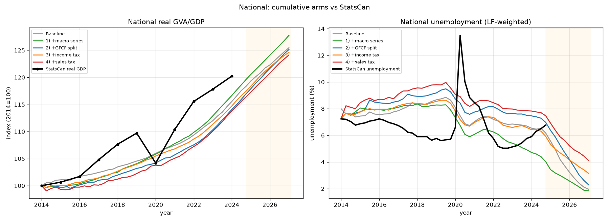
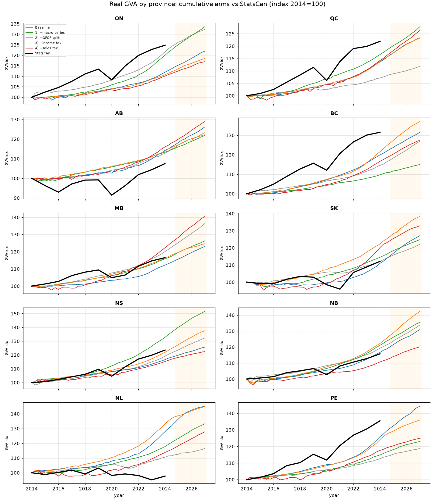
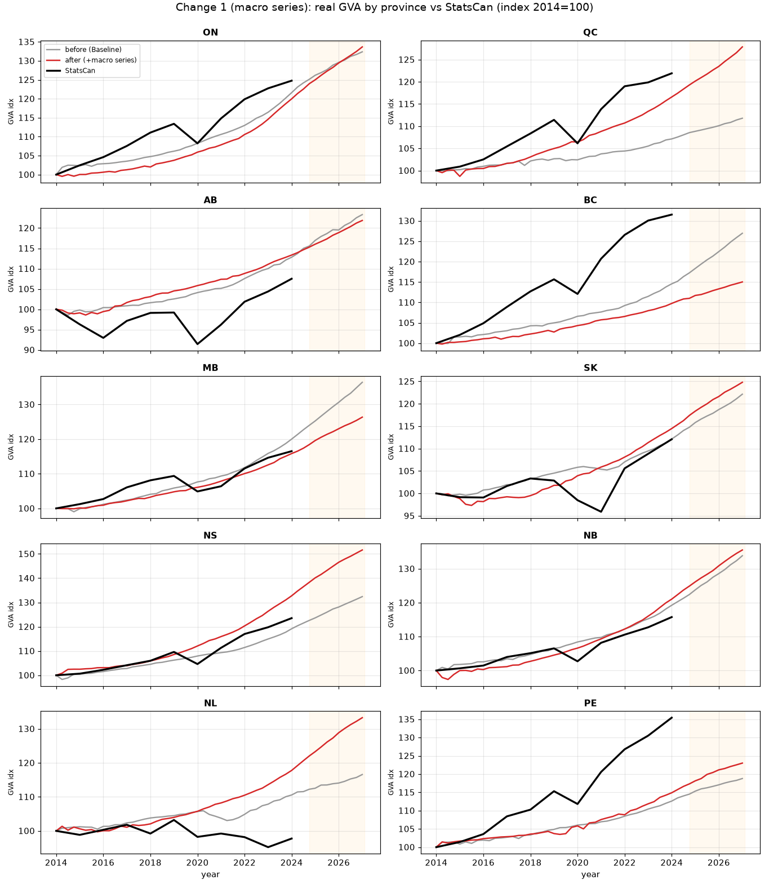
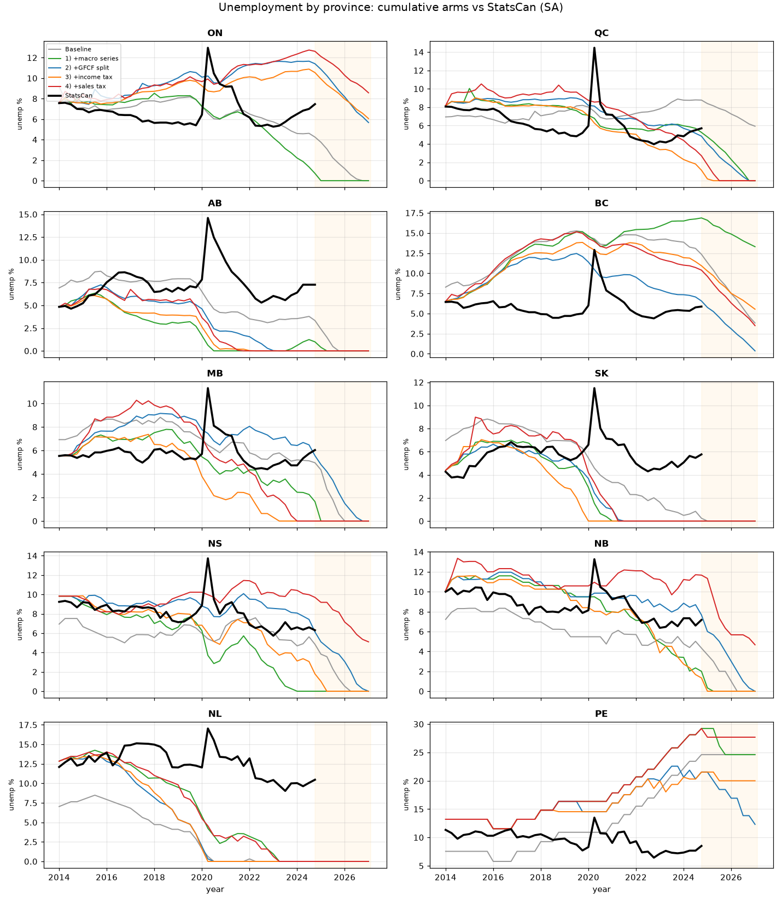
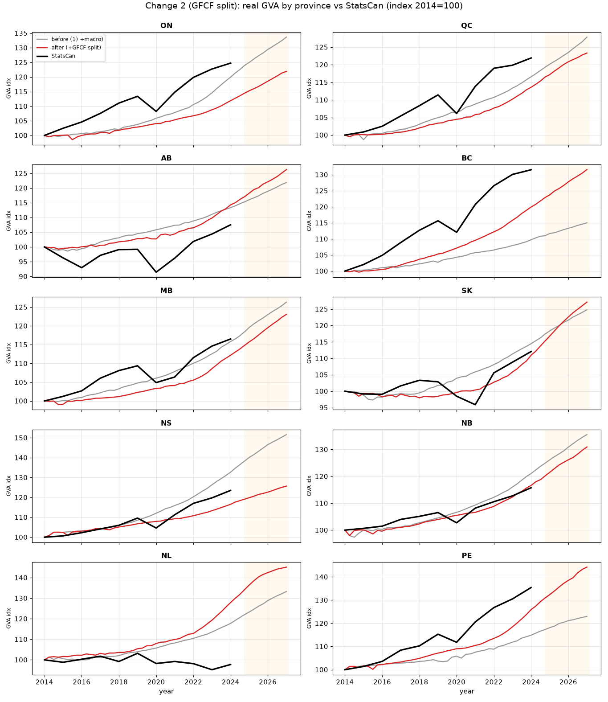
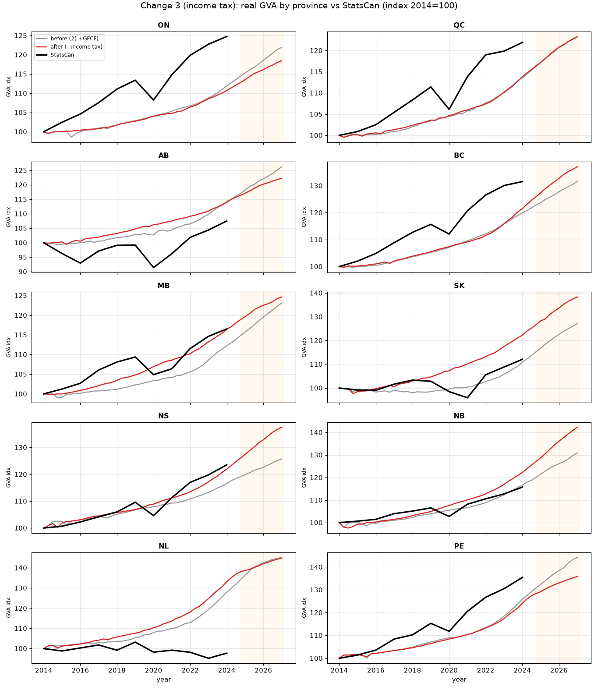
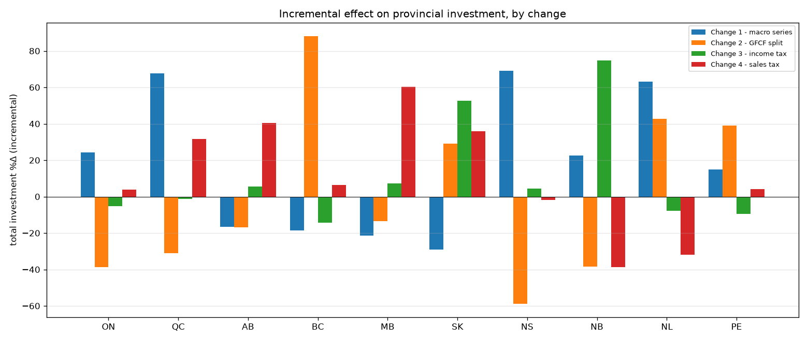
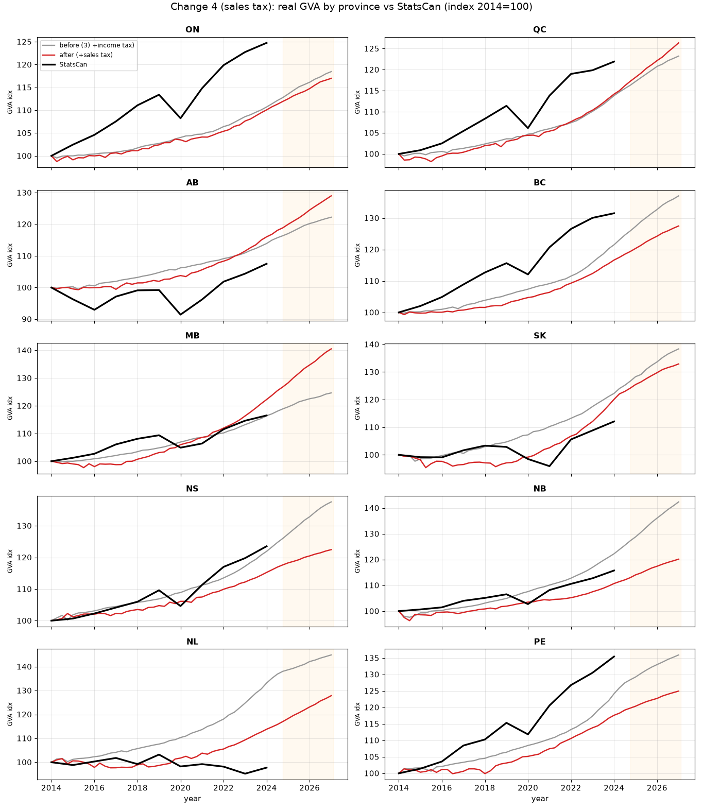

# Provincial Data — Candidate Baseline Incremental Comparison

This document measures how each **provincial-data upgrade** changes the model's provincial
dynamics under the candidate growth baseline, and how the results compare to observed
Statistics Canada data. Five data changes are assessed, added one at a time.

## The provincial-data changes

Each change replaces a national (or foreign-proxy) input — previously applied identically to
every province — with province-specific Statistics Canada data. See `provincial_raw_data.md`
for full provenance.

| # | Change | What it replaces (same value for all 10 provinces before) | Provincial source |
|---|--------|-----------------------------------------------------------|-------------------|
| **1** | **Macro series** | National CPI, unemployment, house-price and vacancy series stamped onto every province (house-price/vacancy were degenerate/empty for Canada) | Provincial CPI (18‑10‑0004), LFS (14‑10‑0287), New Housing Price Index (18‑10‑0205), Job Vacancy survey (14‑10‑0325) |
| **2** | **GFCF split** | A single **French** (Eurostat) split of investment across firms / households / government (0.567 / 0.263 / 0.170) | Provincial expenditure-based GDP (36‑10‑0222) |
| **3** | **Effective income tax** | National **statutory** combined corporate rate (~26.5%) and a hard-coded 0.09 personal rate | PTEA effective corporate/personal rates (36‑10‑0450 / 36‑10‑0221 / 36‑10‑0224) |
| **4** | **Sales tax** | A single national VAT rate applied as a flat consumption wedge | PTEA effective consumption (sales/VAT) rate |
| **5** | **Labour compensation** | A **French**-proxied wage bill (WIOD SEA is empty for Canada: 1 of 56 industries non-zero), giving an 84.4% initial labour share | StatCan supply-use extract — the same source as the IO table (49.8%) |

## Reference scenario and method

The reference scenario is the candidate growth baseline (`scripts/run_candidate_baseline.py` /
`apply_candidate_growth_baseline`): the 10-province × 43-sector model with the observed
provincial labour-force paths, a common +2%/yr household-demand overlay, exogenous national
accounts held flat past the ~2023Q4 data tail, run **53 quarters at seed 0**. A capture-runner
mirroring it records, **per province**, double-deflated real GVA (real output − real intermediate
at base-year prices), unemployment, and total investment (firm GFCF + household investment).

The four changes are assessed **cumulatively** — each arm adds one change on top of the previous,
so each change's section reports the *incremental* effect of that change alone:

| Arm | Provincial data baked into the pickle |
|-----|---------------------------------------|
| **Baseline** | none (national/proxy, replicated to provinces) |
| **+1** | + macro series |
| **+1+2** | + GFCF split |
| **+1+2+3** | + income tax |
| **+1+2+3+4** | + sales tax |

All arms share the identical simulation config and differ only in the pickle (built by staging
which `<raw_data>/canadian_inputs/` files are present). The sales-tax commit only *added* a
`sales_tax_rate` column — the effective corporate/personal rates are byte-identical between the
income-tax and sales-tax arms — so arm `+1+2+3+4` isolates the sales tax exactly.

## National overview vs StatsCan

| Arm | Real GVA growth (%/yr) | Mean unemployment |
|-----|----------------------:|------------------:|
| Baseline | 1.76 | 6.8% |
| +1 (macro) | 1.90 | 7.1% |
| +1+2 (GFCF) | 1.74 | 7.5% |
| +1+2+3 (income tax) | 1.71 | 6.7% |
| +1+2+3+4 (sales tax) | 1.68 | 8.4% |

At the national level every change is small on growth (the four arms sit within ~0.2 pp/yr of
each other) and the whole stack tracks the observed StatsCan real-GDP **trend** (~1.8%/yr), while
— as a smooth baseline — missing the 2020 COVID contraction and rebound. The changes act mainly by
**reallocating activity across provinces**, and (for the tax changes) by shifting the
consumption/investment mix. National unemployment drifts up as the tax wedges are added.

The per-province build-up against StatsCan (all five arms per panel):

> **Read the long horizon with care.** Past ~2024 (shaded) the candidate baseline drifts toward a
> full-employment ceiling — see Caveats. The reliable signal is the **initial conditions and
> 2014–2024 comparison to StatsCan**, not the absolute end-of-horizon level.

---

# Change 1 — Macro series

Replaces the national CPI / unemployment / house-price / vacancy series (previously stamped onto
every province) with province-specific StatsCan series. Its clearest effect is on **labour-market
initial conditions**: provinces now start at their true 2014 unemployment rates (AB/SK ~4.5%,
NL/PE ~13%) instead of a uniform ~7%.

Incremental effect (Baseline → +macro):

| Prov | GVA growth (%/yr) | Δ GVA (pp) | Δ mean unemp (pp) | Investment %Δ |
|------|:-----------------:|-----------:|------------------:|--------------:|
| ON | 2.18 → 2.26 | +0.08 | −0.5 | +24 |
| QC | 0.86 → 1.91 | +1.05 | −1.0 | +68 |
| AB | 1.63 → 1.53 | −0.09 | −3.0 | −17 |
| BC | 1.85 → 1.08 | −0.77 | +1.4 | −19 |
| MB | 2.42 → 1.82 | −0.60 | −1.6 | −22 |
| SK | 1.55 → 1.72 | +0.17 | −1.6 | −29 |
| NS | 2.18 → 3.25 | +1.07 | −0.6 | +69 |
| NB | 2.27 → 2.37 | +0.10 | +1.7 | +23 |
| NL | 1.19 → 2.23 | +1.05 | +3.2 | +63 |
| PE | 1.33 → 1.61 | +0.27 | +4.7 | +15 |

- In the unemployment panel, the +macro line (green) snaps onto each province's **StatsCan
  starting level** in 2014 — the realistic provincial spread that the baseline lacked.
- Provincial growth re-sorts by up to ±1 pp/yr (QC, NL, NS gain; BC, MB lose), driven by each
  province's own inflation and labour-market slack.

---

# Change 2 — GFCF split

Replaces the single **French** firm/household/government split of investment with province-specific
shares from the provincial expenditure accounts. Resource provinces become much more
firm-investment-heavy (AB ~0.75 firm share vs 0.57 French); housing-oriented provinces carry more
household investment.

Incremental effect (+macro → +GFCF):

| Prov | GVA growth (%/yr) | Δ GVA (pp) | Δ mean unemp (pp) | Investment %Δ |
|------|:-----------------:|-----------:|------------------:|--------------:|
| ON | 2.26 → 1.54 | −0.72 | +4.2 | −39 |
| QC | 1.91 → 1.63 | −0.28 | +0.3 | −31 |
| AB | 1.53 → 1.81 | +0.28 | +1.0 | −17 |
| BC | 1.08 → 2.13 | +1.05 | −5.0 | +88 |
| MB | 1.82 → 1.61 | −0.20 | +2.1 | −13 |
| SK | 1.72 → 1.86 | +0.15 | +0.0 | +29 |
| NS | 3.25 → 1.78 | −1.48 | +3.2 | −59 |
| NB | 2.37 → 2.09 | −0.27 | +1.7 | −39 |
| NL | 2.23 → 2.91 | +0.67 | −1.5 | +43 |
| PE | 1.61 → 2.86 | +1.25 | −2.7 | +39 |

- This is the largest **investment-composition** effect of the four changes: total provincial
  investment swings from −59% (NS) to +88% (BC), following the firm/household reallocation.
- Growth reallocates toward the provinces whose investment mix rises (BC, PE, NL, SK up; NS, ON
  down).

---

# Change 3 — Effective income tax

Replaces the national **statutory** combined corporate rate (~26.5%) and hard-coded 0.09 personal
rate with province-specific **effective** rates from the PTEA (2014 corporate: NL ~0.10 … NS 0.47;
personal ~0.16–0.19). Because the model applies tax rates flat, the effective rate is the correct
scalar; the correction both changes the national average and adds cross-province variation.

Incremental effect (+GFCF → +income tax):

| Prov | GVA growth (%/yr) | Δ GVA (pp) | Δ mean unemp (pp) | Investment %Δ |
|------|:-----------------:|-----------:|------------------:|--------------:|
| ON | 1.54 → 1.31 | −0.23 | −0.6 | −5 |
| QC | 1.63 → 1.62 | −0.01 | −1.4 | −1 |
| AB | 1.81 → 1.56 | −0.25 | −0.8 | +5 |
| BC | 2.13 → 2.45 | +0.32 | +2.5 | −14 |
| MB | 1.61 → 1.71 | +0.10 | −3.2 | +7 |
| SK | 1.86 → 2.53 | +0.67 | −0.5 | +53 |
| NS | 1.78 → 2.48 | +0.71 | −2.1 | +4 |
| NB | 2.09 → 2.75 | +0.66 | −1.9 | +75 |
| NL | 2.91 → 2.89 | −0.01 | +0.1 | −8 |
| PE | 2.86 → 2.39 | −0.47 | +0.2 | −10 |

- Investment is the most tax-sensitive channel: provinces whose **effective corporate rate falls
  below the old 26.5% statutory rate** (NL, MB, NB, SK) get more firm net income and invest more;
  the direction is heterogeneous and, at a single seed, noisy.

The incremental investment effect of each change side-by-side (changes 3 and 4 are the tax
changes):

---

# Change 4 — Sales tax

Replaces the single national VAT rate with a province-specific **effective consumption-tax rate**
(2014: AB ~0.035 — GST-only — vs ~0.07–0.10 elsewhere). The model applies it as a flat wedge on
final household consumption, so provinces with a low effective rate (Alberta) get a consumption
boost and high-rate provinces a drag.

Incremental effect (+income tax → +sales tax):

| Prov | GVA growth (%/yr) | Δ GVA (pp) | Δ mean unemp (pp) | Investment %Δ |
|------|:-----------------:|-----------:|------------------:|--------------:|
| ON | 1.31 → 1.21 | −0.10 | +1.1 | +4 |
| QC | 1.62 → 1.82 | +0.20 | +1.4 | +32 |
| AB | 1.56 → 1.98 | +0.42 | +0.6 | +41 |
| BC | 2.45 → 1.89 | −0.57 | +0.2 | +6 |
| MB | 1.71 → 2.65 | +0.94 | +1.6 | +60 |
| SK | 2.53 → 2.21 | −0.32 | +1.2 | +36 |
| NS | 2.48 → 1.57 | −0.91 | +3.4 | −2 |
| NB | 2.75 → 1.42 | −1.33 | +3.7 | −39 |
| NL | 2.89 → 1.91 | −0.99 | +1.4 | −32 |
| PE | 2.39 → 1.73 | −0.66 | +2.8 | +4 |

- Alberta gains (lowest consumption tax → more consumption/investment); several high-rate
  provinces (NB, NS, NL) lose growth and gain unemployment as the consumption wedge dampens demand.
- The sales-tax wedge is the change that most clearly **raises national unemployment** (6.7% →
  8.4% mean), consistent with a consumption drag.

---

## Interpretation

1. **Each change is a provincial-composition correction.** The national growth aggregate barely
   moves (1.68–1.90%/yr across all arms); what changes is *which* provinces lead and the
   consumption/investment mix.
2. **The changes target different channels.** #1 fixes labour-market initial conditions; #2 is the
   biggest investment-composition mover; #3 shifts firm investment via effective corporate rates;
   #4 shifts consumption (and unemployment) via the effective sales rate.
3. **Against StatsCan (2014–2024),** the model reproduces provincial growth *trends* well for
   several provinces and poorly for the resource provinces whose observed paths are dominated by
   oil-price shocks a smooth baseline cannot produce (AB, NL). #1 clearly improves the match of
   provincial unemployment *levels*.

---

# Change 5 — Labour compensation (initial wage bill)

Replaces the **WIOD SEA** labour-compensation vector — which for Canada is effectively empty
(1 of 56 industry rows non-zero for 2014) and is therefore filled from the **French** proxy —
with a rescale onto Canada's observed labour share, taken from the same StatCan supply-use
extract the provincial IO table was built from. See `provincial_raw_data.md` §3d.

This change differs in kind from #1–#4: it is **not** a provincial-composition correction but a
**national level correction to firms' initial balance sheets**.

### What it fixes

Value added was already accurate — the model's total ($1.7332T annualised) matches StatCan 2014
value added ($1.7303T) to 0.17% — so the entire error sat on the labour side:

| | labour share of value added | initial firm profits (all provinces, annualised) |
|---|---:|---:|
| Before | **84.44%** | **−35,075,722,142** |
| After | **49.76%** | **+565,994,798,402** |
| StatCan observed | 49.76% | — |

**Firms go from loss-making to profitable at initialisation.** Value added is byte-identical
between the two pickles, so this is a clean single-variable change.

### Incremental effect (53q, seed 0)

| Arm | Real GVA | GVA growth (%/yr) | Unemployment (start → end) |
|-----|---------|------------------:|---------------------------:|
| Pre-fix (84.4% labour share) | 470.0B → 582.7B | **1.67** | 8.3% → 4.9% |
| **+5 (labour compensation)** | 470.0B → 578.6B | **1.61** | 8.3% → **2.5%** |

- **Headline growth barely moves** (−0.06 pp/yr), consistent with #1–#4: the national aggregate
  is insensitive to each individual data change.
- **Unemployment falls further** (4.9% → 2.5%): profitable firms hire more, pushing the run
  harder into the documented full-employment ceiling. End-of-horizon unemployment should be read
  with the existing ceiling caveat, not as an improvement.

### Why the 53-quarter horizon *understates* this change

This is the important qualification. At 53 quarters the pre-fix model looks healthy — 1.67%/yr
growth, unemployment falling to 4.9% — and the 84.4% labour share does not surface in any
headline number. It becomes visible only at longer horizons: the labour share drifts upward from
its already-inflated start, crosses **100% around 2023** (wages exceeding the value firms
create), and at the ~89-quarter horizon used by the CER–macroABM runs the economy collapses
entirely (43/43 sectors below 5% of their 2020 level; see
`../../docs/cer_macroabm/results_assessment_2026.md` in M3-linkages).

**Implication for Changes 1–4 above:** all four were measured on this same defect, on a horizon
too short to expose it. Their numbers remain valid as *relative* comparisons between data
changes — each arm shares the identical starting distortion — but none of them was a test of
whether the underlying calibration was sound, and the absolute levels inherit the distortion.
Re-running the four arms on the corrected pickle would be needed before treating any absolute
figure here as calibrated.

### Method note

Arms measured with `scripts/run_candidate_baseline.py` at 53 quarters, seed 0 — the reference
scenario for this document. The pre-fix arm reproduces the published range (1.68–1.90%/yr) at
1.67%/yr, confirming the harness matches. Only **national** aggregates are reported: the
per-province capture-runner used for #1–#4 lives in the validation workspace and is not in this
repo, so no per-province table is given for this change.

## Caveats

- **Single seed.** All runs are seed 0. The candidate baseline is documented as robust across five
  seeds in aggregate, but per-province trajectories — especially the **investment** magnitudes —
  carry seed noise and are **directional only**. Confirm with a multi-seed sweep before any
  province-level quantitative use.
- **Changes 1-4 were measured before Change 5.** Their arms all carry the 84.4% labour share and
  loss-making initial firms (see Change 5). The relative comparisons between them remain valid —
  every arm shares the same distortion — but absolute levels inherit it, and the 53-quarter
  horizon is too short for the defect to surface. Re-run on the corrected pickle before using
  any absolute figure.
- **Full-employment ceiling.** Past ~2024 the baseline drives most provinces toward 0%
  unemployment (flagged in `INTERIM_GROWTH_BASELINE.md`), so end-of-horizon unemployment is
  compressed; rely on initial conditions and the 2014–2024 window.
- **Tax changes mix a level correction with provincialization.** #3 and #4 change both the national
  concept (statutory→effective corporate; the personal rate ~doubles from 0.09; a national→
  provincial consumption wedge) *and* the cross-province variation, so part of each tax effect is a
  national-level correction, not pure reallocation.
- **Provisional baseline.** Per `INTERIM_GROWTH_BASELINE.md`, this baseline is for model
  development and controlled comparison, not yet validated for quantitative inference; provincial
  allocation is aggregation-dependent.
- Built with the standard disagg-sector-province config (single firm/bank/government per province,
  `constructor="Default"`, proxy FRA, 2014 base); pickles are not committed (large).
