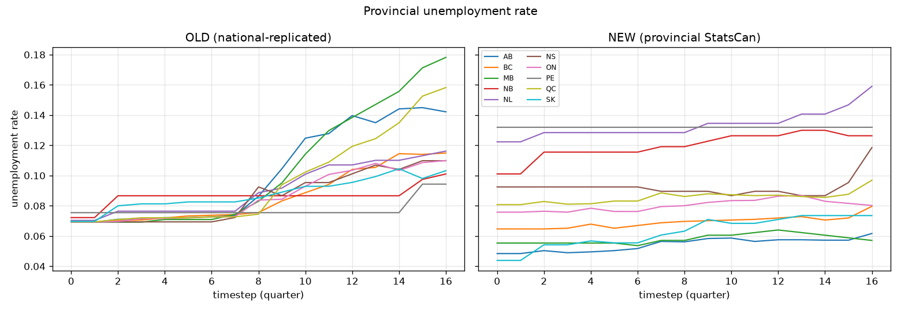
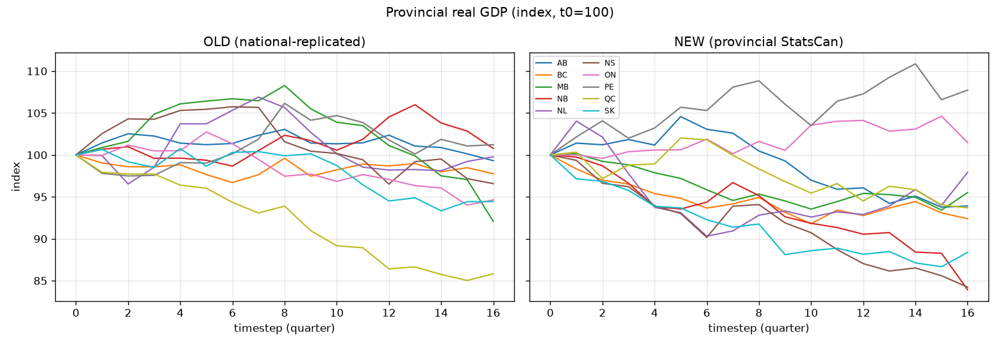
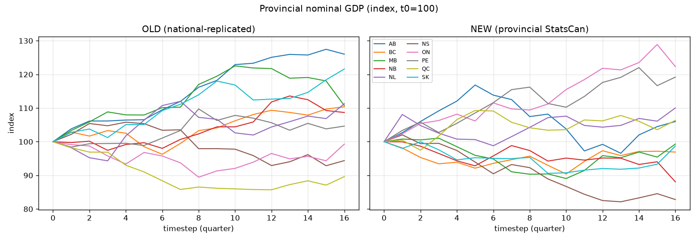
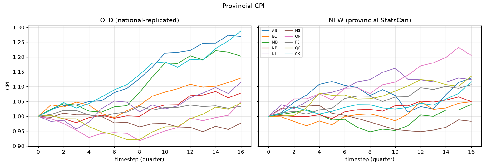

# Provincial Macro Data — Scenario Comparison

Comparison of two otherwise-identical provincial runs that differ **only** in the four
macro series upgraded on the `provincial_raw_data` branch (CPI, unemployment, house-price
growth, vacancy). See `provincial_raw_data.md` for the data and code changes.

## Run configuration (identical across both scenarios)

- Base config: `scenarios/run_canada_provincial.py` (Sample provincial notebook settings) —
  TFP growth (`SimpleTFPGrowth`), technical-coefficient growth, single firm/bank/government
  per province, `time_unit = 3`, `seed = 0`.
- **Energy-bundle substitution enabled**: the CIMS energy carriers
  `[B05a, B05b, B05c, C19, D]` (coal, natural gas, crude oil, refined petroleum, electricity)
  are grouped into one `BundledLeontief` substitution bundle (indices `[1, 2, 3, 10, 24]`).
- Horizon: 16 quarterly steps (4 years).

| Scenario | Data pickle | Macro series |
|----------|-------------|--------------|
| **OLD** | `scenarios/MacroABM Reference/data_provincial_model.pkl` | National Canada, replicated identically to every province |
| **NEW** | `data_provincial_model_NEW.pkl` (rebuilt with the override) | Province-specific StatsCan series |

Both pickles are structurally identical apart from the four series (GDP and compensation
levels match to ~1e-16).

## Headline result — cross-province dispersion

Mean coefficient of variation across the ten provinces, averaged over the run:

| Variable | OLD | NEW | NEW / OLD |
|----------|-----|-----|-----------|
| **Unemployment rate** | 0.113 | 0.325 | **2.89×** |
| CPI | 0.059 | 0.043 | 0.73× |
| Real GDP (levels) | 1.12 | 1.15 | 1.03× |
| Nominal GDP (levels) | 1.09 | 1.19 | 1.09× |
| Consumption (levels) | 1.10 | 1.18 | 1.07× |

> The GDP / consumption CVs are dominated by province **size** (Ontario vs PEI), so they are
> not the cleanest dispersion signal. The rate variables (unemployment, CPI) are
> size-independent and meaningful. Unemployment dispersion **nearly triples**, and — more
> importantly — it is now *correctly structured* rather than noise-driven (below).

## Unemployment — structure, not just spread

- **OLD (left):** every province starts at the same ~6.9% national rate and then fans out
  **randomly** as model noise accumulates. By the end, Manitoba and Alberta reach 14–18%,
  which has no basis in their actual (tight) labour markets. The ordering is an artefact.
- **NEW (right):** provinces start at their **true 2014 rates** and hold a realistic,
  persistent ranking throughout: Atlantic provinces (NL, PE, NS, NB) stay high, the West
  (SK, AB, MB, BC) stays low. This is the provincial labour-market heterogeneity the model
  is supposed to represent.

Unemployment level, first (t0) and last (tN) step:

| Prov | OLD t0 | OLD tN | NEW t0 | NEW tN |
|------|-------:|-------:|-------:|-------:|
| AB | 0.069 | 0.142 | **0.048** | 0.062 |
| BC | 0.069 | 0.115 | 0.065 | 0.080 |
| MB | 0.069 | 0.178 | 0.055 | 0.057 |
| NB | 0.072 | 0.101 | 0.101 | 0.126 |
| NL | 0.070 | 0.116 | **0.122** | 0.159 |
| NS | 0.069 | 0.110 | 0.092 | 0.118 |
| ON | 0.069 | 0.110 | 0.076 | 0.080 |
| PE | 0.075 | 0.094 | **0.132** | 0.132 |
| QC | 0.069 | 0.158 | 0.081 | 0.097 |
| SK | 0.070 | 0.103 | **0.044** | 0.074 |

Note how OLD `t0` is essentially flat (~0.069–0.075, the national value), while NEW `t0`
spans 4.4% (SK) to 13.2% (PE) — the real 2014 provincial spread.

## Real GDP — different growth ordering

Real GDP index (t0 = 100), final value:

| Prov | OLD | NEW |  | Prov | OLD | NEW |
|------|----:|----:|--|------|----:|----:|
| AB | 99.3 | 93.9 | | NS | 96.6 | 84.2 |
| BC | 97.8 | 92.4 | | ON | 94.6 | 101.5 |
| MB | 92.1 | 95.5 | | PE | 101.2 | 107.7 |
| NB | 100.8 | 83.9 | | QC | 85.8 | 93.7 |
| NL | 99.8 | 97.9 | | SK | 94.4 | 88.4 |

The provincial growth ranking reorders materially. Under OLD, Quebec alone collapses (an
artefact of identical starting conditions plus noise); under NEW, Ontario and PEI lead while
several Atlantic provinces and Saskatchewan contract more — trajectories now shaped by each
province's own inflation, labour-market slack and house-price path.

## Interpretation

1. The upgrade delivers what it was meant to: **province-specific macro dynamics** rather
   than a single national path stamped onto ten provinces.
2. The largest, cleanest effect is on the **labour market** — unemployment now reflects real
   provincial conditions from the first step and stays economically ordered, instead of
   diverging only through simulation noise.
3. Growth and consumption trajectories shift as a consequence, so downstream provincial
   results (and any CIMS-linkage feedback that depends on provincial output) change in a
   defensible, data-grounded way.

## Caveats

- Short horizon (16 quarters) with a single seed — this is a **directional** demonstration
  of the data effect, not a calibrated policy run. Confirm with longer horizons and multiple
  seeds before drawing quantitative conclusions.
- Only item #1 of the upgrade list is applied; firm-size, firm-financial, sectoral-growth and
  household-income inputs are still national/proxy, so some remaining cross-province similarity
  is expected.
- CPI dispersion is slightly *lower* under NEW: real provincial CPI inflation is more
  homogeneous than the model's endogenous CPI was — plausible, since Canadian provincial
  inflation is fairly synchronized.
